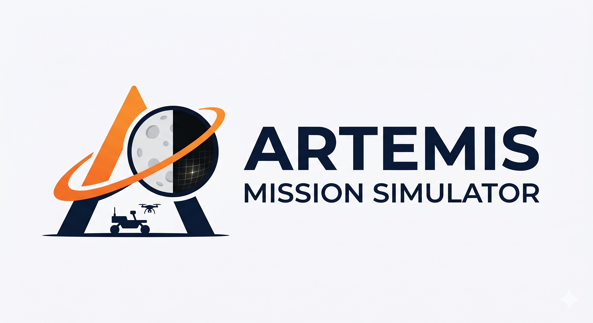
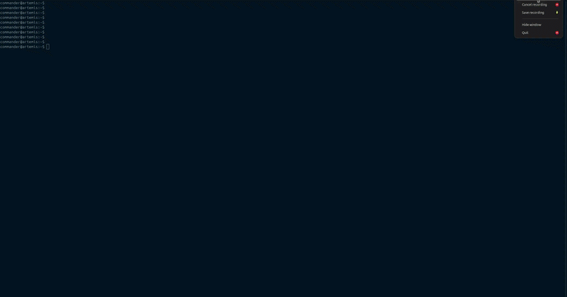

<p align="center">
  
</p>

<p align="center">
  <a href="https://github.com/jasmeet0915/artemis_mission_simulator/actions/workflows/build_and_test.yml">
    
  </a>
  
  
  
</p>

<p align="center">
  An open-source ROS 2 + Gazebo platform for simulating NASA's Artemis lunar missions —
  terrain, illumination, robotics, and beyond.
</p>

---

<p align="center">
  
  <br/>
  <em>Shackleton Rim terrain in Gazebo, generated from NASA LRO elevation data</em>
</p>

---

## Overview

Artemis Mission Simulator is a plug-and-play simulation playground for researchers and engineers working on space robotics for the Artemis programme. The goal is two-fold: simulate the lunar environment as faithfully as possible, and provide a ready-to-use testing ground for rovers, drones, humanoids, and other systems intended for lunar surface operations.

**Milestone 1 — Lunar Environment (in progress)**
- Real terrain from NASA PGDA-78 LRO elevation data for Artemis south-pole landing sites
- Accurate solar illumination and permanently shadowed regions via ephemeris data
- Procedural surface texturing for VO and SLAM testing

**Upcoming milestones**
- Moonfall drone simulation
- Lunar Terrain Vehicles (LTVs) and rovers
- Lunar base environment

## Packages

| Package | Description |
|---------|-------------|
| [`lunar_terrain_exporter`](lunar_terrain_exporter/) | CLI tool for generating Gazebo SDF terrain models from NASA PGDA-78 south-pole DEMs |
| [`artemis_mission_launcher`](artemis_mission_launcher/) | ROS 2 launch files and Gazebo world definitions |

## Setup

### Prerequisites

- Docker
- X11 display server (Linux) or XQuartz (macOS)
- NVIDIA GPU + [nvidia-container-toolkit](https://docs.nvidia.com/datacenter/cloud-native/container-toolkit/latest/install-guide.html)

### Option A — Docker scripts

```bash
# Build the image
./docker/build.sh

# Launch the container (auto-detects NVIDIA GPU, mounts workspace)
./docker/run.sh

# Inside the container
colcon build --symlink-install
source install/setup.bash
```

### Option B — VS Code Devcontainer

Requires the [Dev Containers](https://marketplace.visualstudio.com/items?itemName=ms-vscode-remote.remote-containers) extension.

1. Open the repo in VS Code.
2. Run **Dev Containers: Reopen in Container**.
3. Build from the terminal:

```bash
colcon build --symlink-install
source install/setup.bash
```

> NVIDIA GPU passthrough is opt-in — uncomment the `--gpus=all` lines in [`.devcontainer/devcontainer.json`](.devcontainer/devcontainer.json).

Both flows map your host UID/GID into the container so mounted files are always owned by your host user. Build artifacts persist across restarts in named Docker volumes. To wipe them after an image rebuild:

```bash
docker volume rm artemis-build artemis-install artemis-log
```

## Launch

```bash
ros2 launch artemis_mission_launcher lunar_surface.launch.py world:=lunar_empty_world
```

## Contributing

See [CONTRIBUTING.md](CONTRIBUTING.md).

## License

Apache 2.0 — see [LICENSE](LICENSE).

---

<p align="center">
  <sub>Logo generated with Google Gemini.</sub>
</p>
