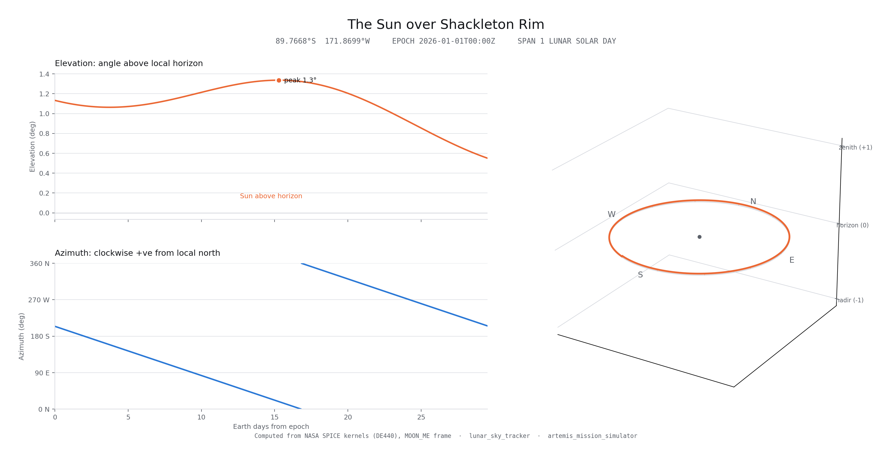
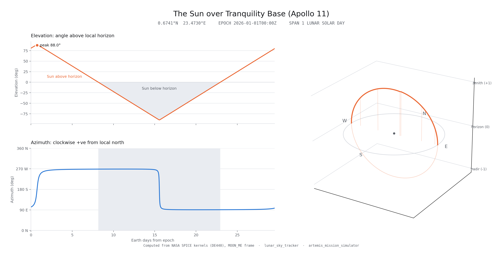

# lunar_sky_tracker

A ROS 2 node that publishes where the Sun sits over a mission site's horizon, computed from NASA SPICE ephemeris data.

## Overview

`lunar_sky_tracker` waits for the mission manager's latched site metadata, then publishes the Sun's direction over that site at a fixed rate. Each message carries both a unit direction vector in the observer's local ENU frame — the form geometry consumers want directly — and the same direction as azimuth/elevation for human readability.

The angles come from SPICE, not from an approximation: real lunar orientation (`MOON_ME`), real DE440 ephemerides, and apparent (light-time and stellar-aberration corrected) positions by default.

## Usage

The node is part of the mission stack, so `artemis liftoff` already runs it in the `sky_tracker` tmux window. To run it on its own:

```bash
ros2 launch lunar_sky_tracker lunar_sky_tracker.launch.py use_sim_time:=true
```

No site argument: the tracker picks the observer up from `/mission/site_metadata` and starts publishing once that arrives.

```bash
ros2 topic echo /lunar_sky_tracker/sun
```

### Topics

| Topic | Type | Direction |
|-------|------|-----------|
| `/mission/site_metadata` | `artemis_mission_interfaces/SiteMetadata` | Subscribed (latched) — supplies the observer's lat/lon |
| `/lunar_sky_tracker/sun` | `artemis_mission_interfaces/SkyObject` | Published — ENU direction plus az/el |

### Parameters

| Parameter | Default | Description |
|-----------|---------|-------------|
| `site_metadata_topic` | `/mission/site_metadata` | Where the observer's site metadata arrives |
| `sun_topic` | `/lunar_sky_tracker/sun` | Where the Sun's `SkyObject` is published |
| `observer_frame` | `site_origin` | `frame_id` stamped on the published message |
| `update_rate` | `1.0` | Hz. The Sun drifts ~1.5e-4 deg/s, so 1 Hz already oversamples its motion |
| `kernel_dir` | `/opt/spice_kernels` | Directory holding the SPICE kernels |

## SPICE Kernels

The node furnishes a pinned kernel set at startup and fails fast if any of it is missing. The kernels are downloaded into the image at build time by [`docker/fetch_spice_kernels.sh`](../docker/fetch_spice_kernels.sh), so there is nothing to fetch at runtime.

| Kernel | Type | Provides |
|--------|------|----------|
| `naif0012.tls` | LSK | Leapseconds, for UTC ↔ ET |
| `de440s.bsp` | SPK | Sun/Earth/Moon ephemeris (DE440 subset) |
| `pck00011.tpc` | Text PCK | Moon radii and flattening |
| `moon_pa_de440_200625.bpc` | Binary PCK | Lunar orientation over time |
| `moon_de440_250416.tf` | FK | `MOON_ME` / `MOON_PA` frame definitions |

## How It Works

Each timer tick runs the same pathway in `spice/celestial_ephemeris.py`:

1. **Epoch** — the clock timestamp (simulation time under `use_sim_time`) becomes a SPICE ET via `str2et`.

2. **Body position** — `spkpos` gives the Sun relative to the Moon's centre in the body-fixed `MOON_ME` frame, aberration-corrected to the apparent position (`LT+S`).

3. **Observer** — `srfrec` turns the site's lat/lon into a `MOON_ME` surface point. Subtracting it from the body position gives the vector the observer actually sees.

4. **Local frame** — `surfnm` gives the surface normal (local Up) and `twovec` builds the ENU triad from it, with the polar axis projected in as North. The vector is rotated into that frame and normalized.

5. **Angles** — `recazl` extracts azimuth and elevation, with the input rearranged so azimuth is north-referenced and increases clockwise (0 = N, 90 = E).

The poles themselves are rejected. The polar axis has no horizontal component there, so North — and therefore azimuth — would be fixed solely by the longitude passed in, which makes the returned angle a labelling choice rather than a measurement.

### Package Structure

```
lunar_sky_tracker/
├── bin/sky_tracker_node                # ros2 run entry point
├── lunar_sky_tracker/
│   ├── __init__.py                     # main() — spins the node
│   ├── lunar_sky_tracker.py            # LunarSkyTracker node: params, timer, publisher
│   └── spice/
│       ├── celestial_ephemeris.py      # The SPICE pathway: ET, ENU rotation, az/el
│       └── kernel_manager.py           # Kernel manifest: verify, furnish, unload
├── launch/
│   └── lunar_sky_tracker.launch.py
├── config/
│   └── lunar_sky_tracker_config.yaml
└── scripts/
    └── plot_sun_path.py               # Sun az/el/orbit plots over a lunar day
```

The node layer and the SPICE layer are kept apart on purpose: `celestial_ephemeris.py` imports nothing from ROS, so the astronomy can be tested without spinning a node.

## Analyses from the celestial_ephemeris module

### Sun path over a lunar solar day

`scripts/plot_sun_path.py` plots the Sun over a site for one lunar solar day, straight from the `celestial_ephemeris` core. Run it in the container after building and sourcing the workspace:

```bash
python3 scripts/plot_sun_path.py --site shackleton_rim --figure briefing
```




- Near the **south pole** (Shackleton) the Sun barely leaves the horizon: it circles at ~1 deg elevation for the whole lunar solar day instead of rising and setting. Near the equator (Tranquility) it arcs overhead and sets, Earth-like.
- Because the Sun stays so low, **terrain decides illumination**. Crater floors sit in permanent shadow (cold traps that hold **water ice**), while nearby rim peaks stay almost always lit (**near-continuous solar power**). Having both side by side is why the pole is a top contender for a **lunar base**.
- Being far from the lunar equator also keeps **temperatures** in a narrower, milder band, without the extreme equatorial day/night swing.

(These plots are the ideal-horizon geometry; the actual dark/lit split needs terrain horizon masking, noted as future work.)
