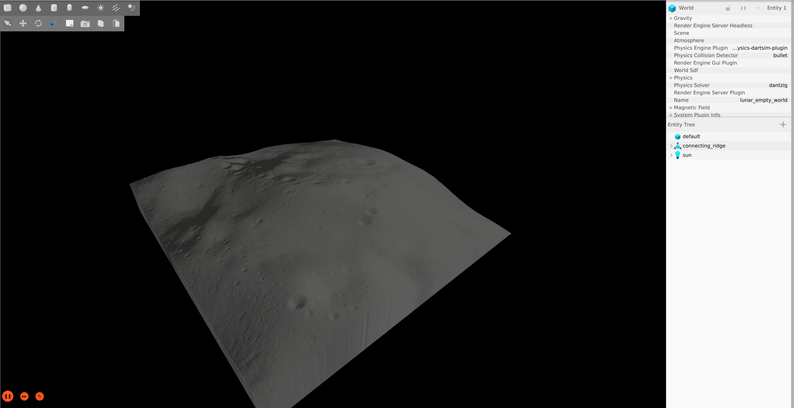
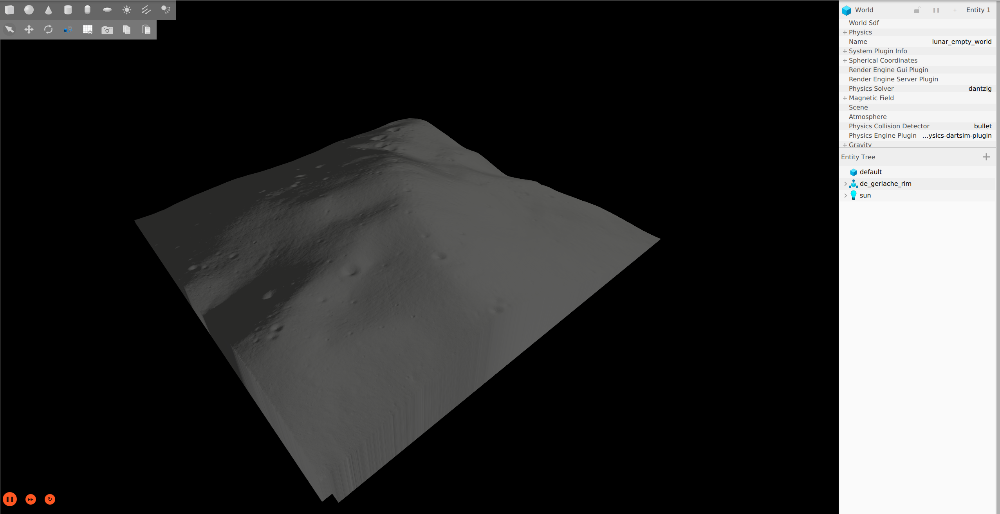
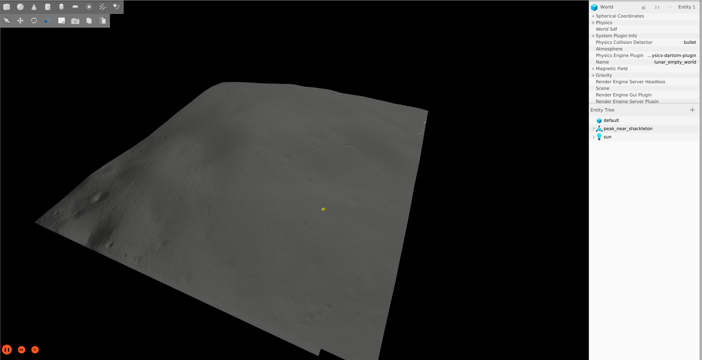
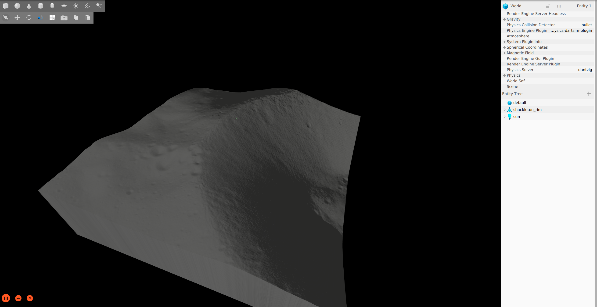

# lunar_terrain_exporter

A CLI tool and Python pipeline for generating simulation ready terrain models from NASA's lunar south-pole DEMs. Currently only SDF models export is supported


<p align="center"><em>A GIF showing the lunar_terrain_exporter cli batch mode in action</em></p>

## Overview

`lunar_terrain_exporter` downloads high-resolution DEM GeoTIFFs from NASA's [Planetary Geodesy Data Archive (PGDA) Product 78](https://pgda.gsfc.nasa.gov/products/78), processes the elevation data, and outputs complete Gazebo-ready SDF models with heightmap geometry and normal maps.

All 27 south-pole landing sites from PGDA Product 78 are available in the built-in [site catalog](lunar_terrain_exporter/utils/site_catalog.py).

### Pre-built sites in the package:

**Name: Connecting Ridge**

*Site Code: Site01*

*Description: Ridge between Shackleton and de Gerlache craters*



**De Gerlache Rim**

*Site Code: Site11*

*Rim of de Gerlache crater*



**Peak Near Shackleton**

*Site Code: Site07*

*Isolated peak near Shackleton crater*



**Shackleton Rim**

*Site Code: Site04*

*Rim of Shackleton crater*



These sites were selected as the best landing site candidates for the Artemis Missions due to their favorable illumination conditions as reported in [this](https://www.sciencedirect.com/science/article/abs/pii/S0032063320303329) paper.

Run `lunar_terrain_exporter site --help` to see the full catalog.

## Usage

### Single site — full DEM tile

Export a terrain model using the entire DEM tile:

```bash
lunar_terrain_exporter site connecting_ridge --output-dir ./models
```

### Single site — custom ROI bounding-box crop

Crop a specific region by specifying center coordinates and dimensions:

```bash
lunar_terrain_exporter site shackleton_rim \
  --lat -86.5 --lon -4.0 --width 5 --height 5 \
  --output-dir ./models
```

### Batch mode

Export multiple sites from a YAML config file:

```bash
lunar_terrain_exporter batch --config config/artemis_sites.yaml --output-dir ./models
```

## Config File Format

The batch config file lists sites by name or catalog code. Each entry can optionally specify a bounding-box ROI:

```yaml
sites:
  - site: connecting_ridge                # Full DEM tile
  - site: shackleton_rim                  # Full DEM tile
  - site: peak_near_shackleton
    roi:
      use_full: false
      bounding_box:
        lat: -86.5
        lon: -4.0
        width_km: 5.0
        height_km: 5.0
```

## Output Structure

Each site generates a complete Gazebo model directory:

```
models/<site_name>/
├── model.sdf                      # SDF with heightmap geometry
├── model.config                   # Gazebo model metadata
├── metadata.yaml                  # Generation parameters (coordinates, sizes, source)
└── materials/
    └── textures/
        ├── heightmap.tif          # Elevation data (GeoTIFF)
        └── normal.png             # Sobel-gradient normal map
```

## How It Works

The pipeline has three stages:

1. **Download** — The `FileDownloader` fetches the DEM GeoTIFF from NASA PGDA and caches it locally (in `.dem_cache/`). Subsequent runs skip the download.

2. **DEM Processing** — The `DEMProcessor` reads the GeoTIFF using `rasterio`, handles the south-pole polar stereographic projection via `pyproj`, and extracts elevation data. If a bounding-box ROI is specified, the raster is windowed to that region. Raw pixel values are converted to elevation in meters using the dataset's scale/offset metadata.

3. **Model Writing** — The `SDFModelWriter` takes the elevation array and generates:
   - A **heightmap GeoTIFF** preserving the original CRS and transform
   - A **normal map** (RGB PNG) derived from Sobel gradients of the normalized elevation data
   - An **SDF model** with `<heightmap>` geometry sized to match the real-world dimensions
   - A **metadata YAML** recording coordinates, dimensions, elevation range, and data source

### Package Structure

```
lunar_terrain_exporter/
├── cli.py                          # CLI entry point (site / batch subcommands)
├── lunar_terrain_exporter.py       # Pipeline orchestrator
├── raster_processors/
│   ├── dem_processor.py            # GeoTIFF reading, cropping, elevation extraction
│   └── normal_map_generator.py     # Sobel-gradient normal map generation
├── model_writers/
│   └── sdf_model_writer.py        # SDF, model.config, heightmap, metadata output
├── utils/
│   ├── types.py                    # LunarSite, ROI, BoundingBox dataclasses
│   ├── site_catalog.py             # PGDA Product 78 site catalog (all 27 sites)
│   ├── raster_utils.py             # Array normalization utilities
│   └── file_downloader.py          # HTTP download with local caching
└── config/
    └── artemis_sites.yaml          # Default batch config for Artemis III candidate sites
```

## Data Source & Citation

Terrain elevation data is sourced from:

> Barker, M.K., et al. (2021). Improved LOLA Elevation Maps for South Pole
> Landing Sites: Error Estimates and Their Impact on Illumination Conditions.
> *Planetary and Space Science*, 203, 105119.
> [doi:10.1016/j.pss.2020.105119](https://doi.org/10.1016/j.pss.2020.105119)

**DEM tiles:** [NASA PGDA Product 78](https://pgda.gsfc.nasa.gov/products/78) — 5 m/pixel improved south-pole DEMs derived from Lunar Orbiter Laser Altimeter (LOLA) data (Moon ME reference frame, polar stereographic projection).
